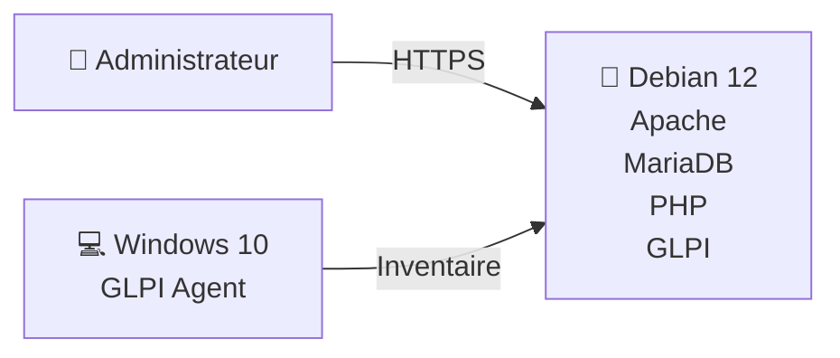

# 🏗️ Architecture

## 🎯 Objectif

L'objectif de cette architecture est de reproduire une infrastructure ITSM simple, sécurisée et facilement reproductible, permettant de mettre en œuvre les principales fonctionnalités de GLPI dans un environnement virtualisé.

Elle repose sur une séparation claire entre le serveur applicatif et le poste client supervisé afin de reproduire une organisation proche d'un environnement professionnel.

## Vue d'ensemble

| **Élément**    | **Rôle**                   |
| ---------- | ---------------------- |
| Proxmox VE | Hyperviseur            |
| Debian 12  | Serveur GLPI           |
| Apache     | Serveur Web            |
| MariaDB    | Base de données        |
| PHP        | Exécution de GLPI      |
| Windows 10 | Poste client           |
| GLPI Agent | Inventaire automatique |

## Architecture logique



## Infrastructure virtuelle

L'ensemble de l'environnement a été déployé sur un hyperviseur **Proxmox VE**, permettant de reproduire une infrastructure proche d'un contexte professionnel tout en facilitant les opérations de déploiement, d'administration et de tests.

Cette architecture repose sur deux machines virtuelles principales :

- 🐧 **Debian 12** (`10.0.0.21`) hébergeant la plateforme **GLPI** ainsi que l'ensemble de la pile **LAMP** (Apache, MariaDB et PHP).
- 💻 **Windows 10** (`10.0.0.22`) jouant le rôle de poste client supervisé grâce à **GLPI Agent**, permettant la remontée automatique de l'inventaire matériel et logiciel.

L'utilisation de la virtualisation offre une infrastructure **isolée, reproductible et facilement évolutive**, tout en permettant de réaliser des tests sans impacter un environnement de production.


> *Figure 1 — Vue de l'infrastructure virtuelle sous Proxmox VE.*

## Description des composants

| **Serveur Debian**    | **Poste Windows**  |
| ---------- | ---------------------- |
| Apache | GLPI-Agent            |
| MariaDB  | Inventaire automatique |
| PHP  |            |
| GLPI |        |
| iptables |      |
| HTTPS |   |

## Flux de communication

| **Source**     | **Destination** | **Port** | **Protocole** | **Fonction** |
| -------------- | ----------- | ---- | --------- | -------------- |
| Administrateur | GLPI        | 443  | HTTPS     | Administration |
| GLPI Agent     | GLPI        | 443  | HTTPS     | Inventaire     |

## Architecture réseau

```texte
10.0.0.0/24

        10.0.0.21
        Debian GLPI

             ▲
             │ HTTPS
             │
        10.0.0.22
        Windows 10
```

# ⚙️ Choix techniques

Les composants de l'infrastructure ont été sélectionnés afin de répondre aux besoins du projet en matière de simplicité de déploiement, de sécurité, de stabilité et de conformité avec les bonnes pratiques d'administration des systèmes.

| Composant | Choix retenu | Justification |
|------------|-------------|---------------|
| **Hyperviseur** | Proxmox VE | Virtualisation légère, snapshots, isolation des machines virtuelles et facilité d'administration. |
| **Système d'exploitation** | Debian 12 | Distribution stable, largement utilisée en entreprise, bénéficiant d'un support à long terme et d'une importante documentation. |
| **Serveur Web** | Apache 2 | Solution éprouvée, parfaitement compatible avec GLPI et simple à sécuriser via HTTPS. |
| **Base de données** | MariaDB | Base de données open source performante, compatible avec MySQL et officiellement supportée par GLPI. |
| **Langage serveur** | PHP | Langage natif de GLPI, indispensable au fonctionnement de l'application. |
| **Solution ITSM** | GLPI | Solution open source complète intégrant gestion des incidents, inventaire, SLA et base de connaissances. |
| **Inventaire** | GLPI Agent | Permet la remontée automatique des informations matérielles et logicielles des postes clients. |
| **Sécurisation** | HTTPS + iptables | Chiffrement des communications et restriction des accès au serveur. |

## 💡 Pourquoi GLPI ?

Avant de retenir GLPI, plusieurs solutions ITSM ont été étudiées.

| Solution | Limites identifiées |
|-----------|---------------------|
| **OTRS** | Plus complexe à administrer pour ce laboratoire. |
| **ServiceNow** | Solution SaaS très complète mais propriétaire et coûteuse. |
| **Zammad** | Excellent outil de ticketing mais moins adapté à la gestion de parc informatique. |
| **GLPI** | Bon compromis entre simplicité, fonctionnalités ITIL, inventaire et coût (open source). |

GLPI a donc été retenu pour sa capacité à centraliser la gestion des incidents, l'inventaire des équipements, les accords de niveau de service (SLA) et la base de connaissances, tout en restant facilement déployable dans un environnement de type PME.

Les choix techniques n'ont pas uniquement été guidés par la facilité d'installation, mais également par leur pertinence dans un contexte professionnel, leur compatibilité avec les bonnes pratiques ITIL et leur capacité à évoluer vers une infrastructure plus complète.

### Évolutions possibles
- Active Directory
- LDAP
- SMTP
- Sauvegardes
- Reverse Proxy
- Haute disponibilité
- Zabbix
- Wazuh

--- 

