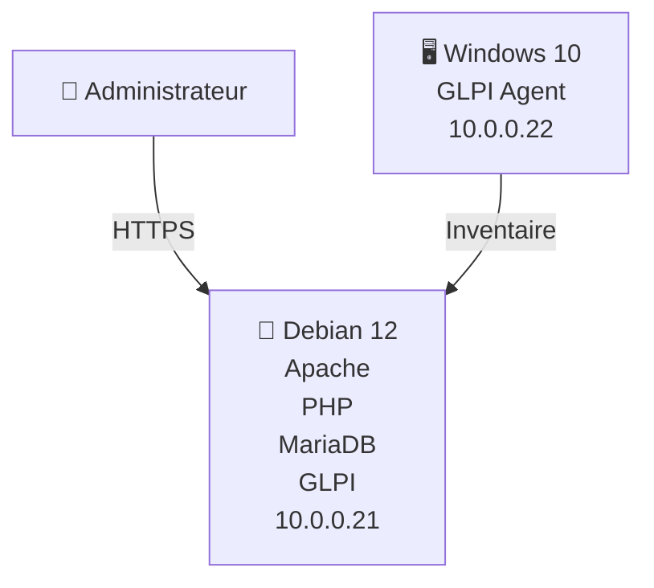

# 🗂️ GLPI-ITIL-Lab

---

# 📖 Présentation

**GLPI-ITIL-Lab** est un laboratoire de virtualisation ayant pour objectif de déployer une plateforme **IT Service Management (ITSM)** basée sur **GLPI**, afin de mettre en œuvre un processus complet de gestion des incidents conforme aux bonnes pratiques **ITIL**.

Ce projet ne se limite pas à l'installation de GLPI : il couvre également le **durcissement du serveur**, la **gestion des équipements**, la **mise en place des SLA**, la **priorisation des incidents**, la **traçabilité des interventions** ainsi que la **capitalisation des connaissances** grâce à une base documentaire.

L'ensemble de l'infrastructure est déployé dans un environnement virtualisé **Proxmox VE**, reproduisant un contexte réaliste d'administration d'infrastructures sécurisées.

---

# ✨ Fonctionnalités

- 🖥️ Déploiement d'un serveur GLPI sous Debian 12
- 🌐 Architecture LAMP (Apache, MariaDB, PHP)
- 🔒 Accès sécurisé en HTTPS
- 🛡️ Durcissement du serveur selon les bonnes pratiques
- 🔥 Protection réseau avec iptables
- 💻 Inventaire automatique des postes via GLPI Agent
- 🎫 Gestion complète des incidents
- 🚦 Priorisation des tickets
- ⏱️ Mise en œuvre des SLA
- 📚 Base de connaissances (FAQ)
- 📝 Historique complet des interventions

---

# 🎯 Objectifs pédagogiques

Ce laboratoire avait pour objectifs de :

- Déployer une solution ITSM professionnelle
- Mettre en œuvre les bonnes pratiques ITIL
- Sécuriser une infrastructure Linux
- Centraliser la gestion des incidents
- Automatiser l'inventaire du parc informatique
- Développer une documentation technique exploitable

---

# 🏢 Contexte

Dans un environnement informatique, la qualité du support technique repose sur la capacité à **centraliser les demandes**, **prioriser les incidents** et **respecter des engagements de service (SLA)**. Sans outil dédié, les interventions deviennent rapidement difficiles à suivre : les demandes sont dispersées, les délais ne sont pas maîtrisés et la traçabilité des actions est limitée.

Afin de répondre à cette problématique, ce laboratoire reproduit le déploiement d'une plateforme **IT Service Management (ITSM)** basée sur **GLPI**, en s'appuyant sur les bonnes pratiques du référentiel **ITIL**.

Le projet a été réalisé dans un environnement virtualisé sous **Proxmox VE**, simulant une infrastructure de type PME composée d'un serveur Debian hébergeant GLPI et d'un poste client Windows supervisé par **GLPI Agent**.

Au-delà de l'installation de l'application, ce laboratoire intègre une approche complète de l'administration d'infrastructures sécurisées :

- 🖥️ déploiement d'une architecture **LAMP** (Linux, Apache, MariaDB, PHP) ;
- 🔒 sécurisation du serveur (HTTPS, durcissement du système, firewall `iptables`, protection des sessions PHP) ;
- 🎫 mise en œuvre d'un processus complet de gestion des incidents ;
- ⏱️ définition de plusieurs niveaux de **Service Level Agreement (SLA)** avec des objectifs de prise en charge (**TTO**) et de résolution (**TTR**) ;
- 🚦 configuration d'une logique de priorisation basée sur l'impact et l'urgence ;
- 📚 création d'une base de connaissances destinée à capitaliser les procédures de résolution des incidents récurrents.

Bien que réalisé dans le cadre de ma formation d'**Administrateur d'Infrastructures Sécurisées**, ce projet dépasse le simple exercice pédagogique. Les scénarios d'exploitation, les choix techniques et les mesures de sécurisation ont été approfondis afin de reproduire une démarche proche de celle attendue dans un contexte professionnel.

---

# 🏗️ Architecture virtualisée

L'environnement est déployé sur un hyperviseur Proxmox VE hébergeant deux machines virtuelles.

| **Élément**    | **Fonction**                        |
| ---------- | --------------------------------------- |
| Proxmox VE | Hyperviseur hébergeant l'infrastructure |
| Debian 12  | Serveur GLPI                            |
| Apache     | Serveur web HTTPS                       |
| MariaDB    | Base de données GLPI                    |
| PHP        | Exécution de l'application GLPI         |
| GLPI Agent | Inventaire automatique des postes       |
| Windows 10 | Poste client supervisé                  |

---

# 🛠️ Technologies utilisées

| **Domaine** | **Solution** |
|----------|----------|
| Hyperviseur | Proxmox VE |
| Serveur | Debian 12 |
| Web | Apache |
| Base de données | MariaDB |
| Langage | PHP |
| ITSM | GLPI |
| Inventaire | GLPI Agent |
| Poste client | Windows 10 |
| Sécurité | HTTPS • iptables |

---

# 🔒 Sécurisation

[📖 Voir la documentation complète sur le HARDENING](https://github.com/FrancoisBarsotti-Oclock/-GLPI-ITIL-Lab/blob/main/docs/%F0%9F%9B%A1%EF%B8%8F%20HARDENING.md)

---

# 🎫 Gestion des incidents

Ce projet met en œuvre un processus de gestion des incidents inspiré des bonnes pratiques **ITIL**, incluant le cycle de vie des tickets, la priorisation, les SLA, les règles métier et la capitalisation des connaissances.

➡️ **Documentation détaillée :**

- [📖 ITIL-PROCESS.md](https://github.com/FrancoisBarsotti-Oclock/-GLPI-ITIL-Lab/blob/main/docs/%F0%9F%94%84%20ITIL-PROCESS.md)

---

# 📸 Captures d'écran

Les principales étapes du projet sont illustrées par des captures d'écran de l'infrastructure, de l'interface GLPI et des fonctionnalités mises en œuvre.

> Cette section sera enrichie progressivement au fil de l'évolution du projet.

---

# 🐞 Dépannage

Les principaux incidents rencontrés lors du déploiement, leurs causes et les procédures de résolution sont documentés dans le guide de dépannage.

➡️ **Documentation détaillée :**

- [📖 TROUBLESHOOTING.md](https://github.com/FrancoisBarsotti-Oclock/-GLPI-ITIL-Lab/blob/main/docs/%F0%9F%90%9E%20TROUBLESHOOTING.md)

---

# 📚 Documentation technique

La documentation détaillée est organisée par thématique afin de faciliter la navigation.

| Document | Description |
|----------|-------------|
| 🏗️ [ARCHITECTURE.md](docs/ARCHITECTURE.md) | Architecture et composants de l'infrastructure |
| 🛡️ [HARDENING.md](docs/HARDENING.md) | Mesures de sécurisation mises en œuvre |
| 🔄 [ITIL-PROCESS.md](docs/ITIL-PROCESS.md) | Gestion des incidents, SLA et règles métier |
| 🐞 [TROUBLESHOOTING.md](docs/TROUBLESHOOTING.md) | Incidents rencontrés et procédures de résolution |
| 📚 [FAQ.md](docs/FAQ.md) | Base de connaissances et procédures récurrentes |
---

# 🚀 Améliorations futures

- Authentification LDAP
- Notifications par e-mail
- Sauvegarde automatisée de MariaDB
- Déploiement avec Ansible
- Supervision via Zabbix
- Tableau de bord SLA

---

# 🎓 Compétences démontrées

| Domaine | Compétence |
|----------|------------|
| Linux | ✅ |
| Apache | ✅ |
| MariaDB | ✅ |
| PHP | ✅ |
| HTTPS | ✅ |
| Firewall | ✅ |
| ITIL | ✅ |
| GLPI | ✅ |
| SLA | ✅ |
| Documentation | ✅ |
| Gestion des incidents | ✅ |

---

# 👤 Auteur

**François Barsotti**

Administrateur d'Infrastructures Sécurisées (titre RNCP en cours de validation)

Passionné par l'administration système, la cybersécurité et l'automatisation des infrastructures.

---
